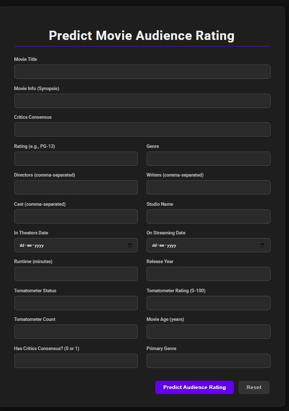
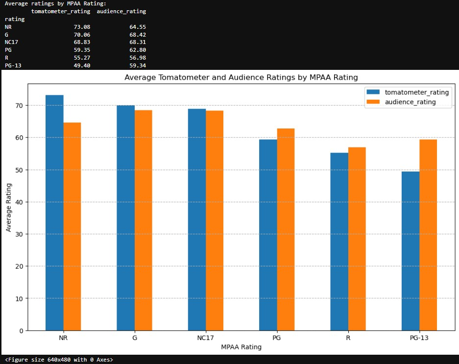

# 🧠 Machine Learning Projects

Welcome to the **Machine Learning Projects Repository**!  
This repo showcases a collection of end-to-end ML projects using Python, covering real-world problems like classification, regression, fault detection, anomaly scoring, and deployment using Flask.

## 📁 Project List

Each project folder contains everything from data ingestion to model deployment:

- **## Movie Audience Rating Prediction 🎬**
  -A regression-based machine learning project to predict a movie's audience rating (0–100) using metadata such as genre, cast, director, tomatometer score, runtime, and more.....
  - The project includes data preprocessing, feature engineering, regression modeling, evaluation, and a Flask-based web interface for predictions.

#### 📸 Project Screenshots
<p align="center">
  
  
  
  
  
  
</p>
<p align="center">
  <em>Left: Model Training Logs &nbsp; | &nbsp; Center: Web UI Prediction Form &nbsp; | &nbsp; Right: Notebook Metrics & Plots</em>
</p>


- **IoT Equipment Fault Prediction**
  - Predict machine failures based on sensor data.
  - SMOTE for imbalance, Logistic Regression, Random Forest, and XGBoost.
  - Deployed via Flask with an interactive UI.

#### 📸 Project Screenshots
<p align="center">
  
  
  
  
  
  
</p>
<p align="center">
  <em>Left: Model Training Logs &nbsp; | &nbsp; Center: Web UI Prediction Form &nbsp; | &nbsp; Right: Notebook Metrics & Plots</em>
</p>

*(More projects are being added continuously...)*
---

## 🧰 Tech Stack

- **Python 3.8+**
- **Scikit-learn, XGBoost, Imbalanced-learn**
- **Flask** for deployment
- **Pandas, NumPy, Matplotlib, Seaborn** for EDA
- **Git & GitHub** for version control

---

## 🚀 Running the Project Locally

1. **Clone the repository:**

```bash
git clone https://github.com/sathikmohamed/ML_Projects.git
cd ML_Projects
 ```
2.**Create a virtual environment and activate it:**
```bash
python -m venv venv
source venv/bin/activate  # On Windows use `venv\Scripts\activate`
```

3.**Install dependencies:**
```bash
pip install -r requirements.txt
Run a specific project (e.g., Flask app):
```
4.**run**
```bash
python app.py
Then visit http://localhost:xxxx in your browser.
```

📦 Folder Structure (Typical)
```bash
ML_projects/
│
├── machine_preventive_maintenance/
├── LICENSE
├── README.md

```
📌 Notes
Large model files (e.g., .pkl) are not tracked by Git due to the 100MB limit.
⚠️ Note:
This project does not include the trained `model.pkl` file due to GitHub's 100MB size limit.

If you wish to run predictions:
- Either train your own model using the provided pipeline, OR
- Contact me for the model file.

All core functionalities (data ingestion, transformation, model training) are available and runnable.

Each project is modular, with data_ingestion, data_transformation, model_trainer, and predict_pipeline components.

📫 Contact
For queries or suggestions, feel free to reach out via GitHub Issues.

