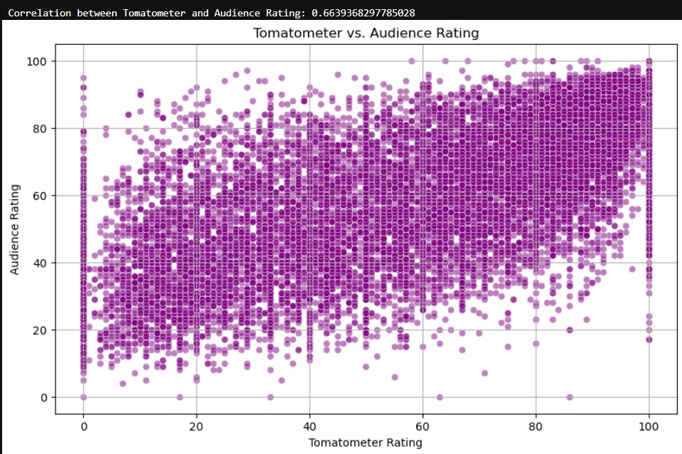
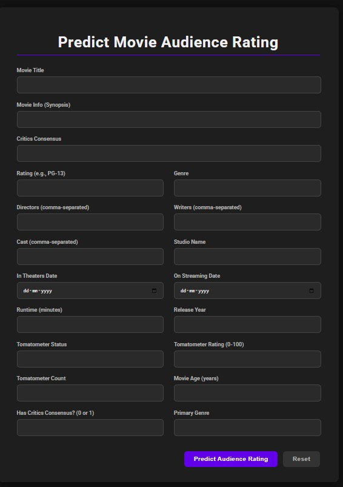
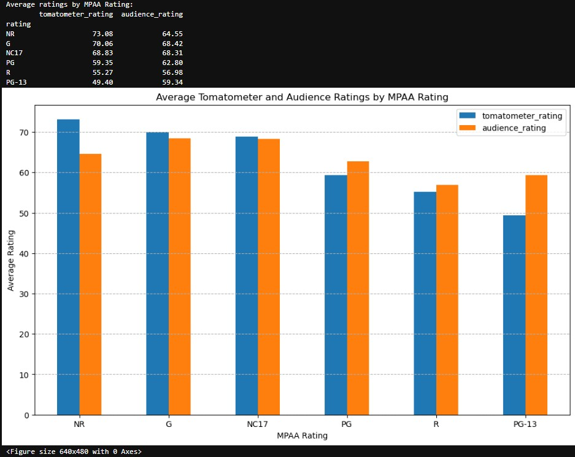
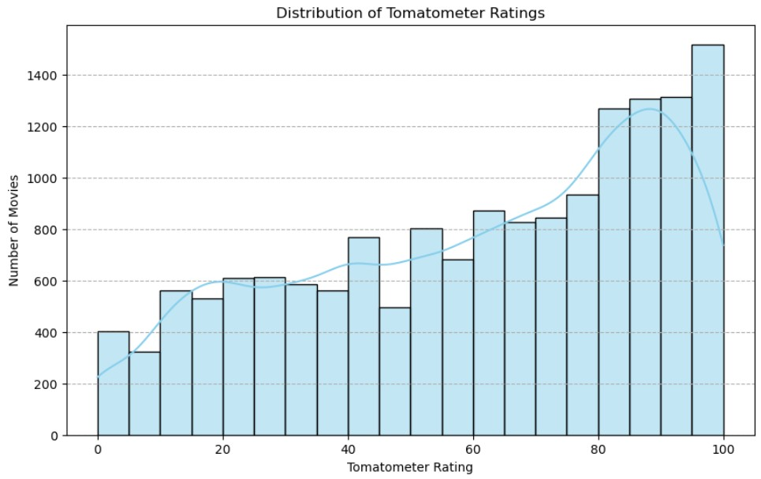
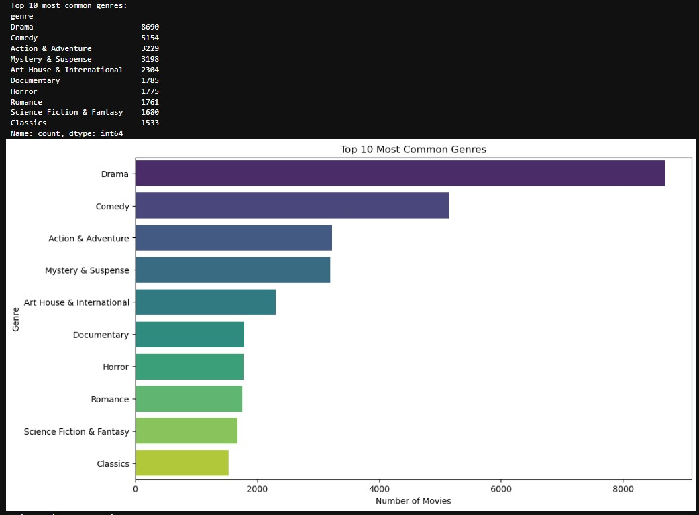
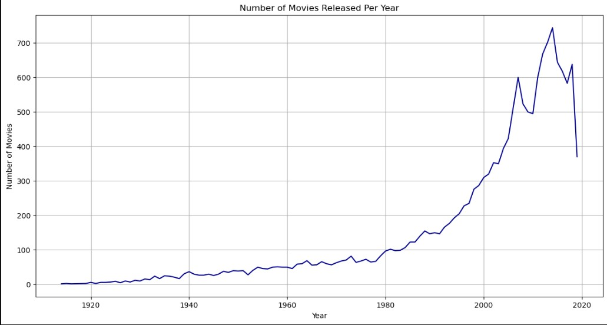

## Movie Audience Rating Prediction 🎬


A regression-based machine learning project to predict a movie's audience rating (0–100) using metadata such as genre, cast, director, tomatometer score, runtime, and more. This solution helps film studios, producers, and platforms forecast audience reception based on pre-release metadata.
The project includes data preprocessing, feature engineering, regression modeling, evaluation, and a Flask-based web interface for predictions.
## 🚀 Features

Data Ingestion: Processes raw movie metadata (title, genre, cast, etc.).
Data Preprocessing: Handles missing values, parses dates, and encodes categorical variables.
Feature Engineering: Extracts features like movie_age_years, primary_genre, and lead actor/director (optional NLP).
Model Training: Implements regression models including Linear Regression, Random Forest, and Gradient Boosting.
Evaluation: Measures performance using Mean Absolute Error (MAE), Root Mean Squared Error (RMSE), and R² Score.
Web Deployment: Deploys a user-friendly Flask interface for real-time predictions.
Modular Design: Organized, reusable code with logging and custom error handling.

## 🧠 Tech Stack
```bash
Python: 3.8+
Data Processing: Pandas, NumPy
Machine Learning: Scikit-learn
Visualization: Matplotlib, Seaborn
Web Framework: Flask
Version Control: Git & GitHub
```
## 📊 Target Variable

audience_rating (float): Audience score between 0 and 100.

## 📁 Directory Structure
```bash
ML_projects/movie_audience_rating_prediction/
│
├── artifacts/              # Saved models and preprocessors
├── notebook/               # Jupyter notebooks for EDA and development
├── src/                    # Source code
│   ├── components/         # Data transformation and model training logic
│   ├── pipeline/           # Prediction pipeline
│   ├── exception.py        # Custom exception handling
│   ├── logger.py           # Logging utility
│   └── utils.py            # Helper functions
├── templates/              # HTML templates for Flask UI
├── app.py                  # Flask application
├── requirements.txt        # Python dependencies
├── README.md               # Project documentation
└── .gitignore              # Git ignore file
```
## 🧪 Workflow

Data Loading:
Load and inspect movie metadata.


Preprocessing:
Handle missing values.
Parse dates and encode categorical variables (genres, cast, studio, etc.).
Normalize/standardize numerical features.


Feature Engineering:
Extract features like movie_age_years, primary_genre, and optionally process lead actor/director using NLP.


Modeling:
Train regression models: Linear Regression, Random Forest Regressor, Gradient Boosting Regressor.


Evaluation:
Metrics: Mean Absolute Error (MAE), Root Mean Squared Error (RMSE), R² Score.


Deployment:
Deploy a Flask-based web interface for predicting audience ratings.


📈 Example Results
Here's the README file for your Movie Audience Rating Prediction project, formatted to be clear, engaging, and professional.

Movie Audience Rating Prediction
Movie Audience Rating Prediction is a machine learning project that predicts a movie's audience score (from 0 to 100) using its metadata. By leveraging data like a movie's genre, cast, director, Tomatometer score, and runtime, this project demonstrates how predictive modeling can help film studios and producers forecast potential audience reception before a movie's release.

The final solution includes everything from data preprocessing and model training to deployment via a Flask web interface.

🚀 Features
Data Ingestion: Ingests raw movie metadata from a source (e.g., CSV, database).

Data Preprocessing: Handles missing values and applies feature engineering.

Model Training: Trains and evaluates various regression models like Random Forest and Linear Regression.

Evaluation: Assesses model performance using key metrics like Mean Absolute Error (MAE), Root Mean Squared Error (RMSE), and R-squared (R²).

Deployment: A user-friendly web interface built with Flask for making real-time predictions.

Modular Design: The project is structured with modular and reusable code, including custom logging and exception handling.

🧠 Tech Stack
Python 3.8+

Data Manipulation: Pandas, NumPy

Machine Learning: Scikit-learn

Visualization: Matplotlib, Seaborn

Web Deployment: Flask

Version Control: Git & GitHub

📁 Directory Structure
Bash

ML_projects/movie_audience_rating_prediction/
│
├── artifacts/              # Saved model and preprocessor objects
├── notebook/               # Jupyter notebooks for EDA and model development
├── src/                    # Source code for the project
│   ├── components/         # Data transformation and model training logic
│   ├── pipeline/           # Prediction pipeline
│   ├── exception.py        # Custom exception handling
│   ├── logger.py           # Logging utility
│   └── utils.py            # Helper functions
├── templates/              # HTML templates for the Flask UI
├── app.py                  # Main Flask application
├── requirements.txt        # Python dependencies
├── README.md               # Project README file
└── .gitignore              # Files and directories to ignore for Git
🧪 Workflow
Data Loading: Load and inspect the raw movie metadata.

Preprocessing: Clean data, handle missing values, and prepare features.

Feature Engineering: Create new features like movie_age_years and extract key information like the primary genre.

Modeling: Train and evaluate several regression models.

Evaluation: Use MAE, RMSE, and R² to determine the best-performing model.

Deployment: Use Flask to create a web UI where users can input movie details and receive a predicted audience rating.

📈 Example Results
<p align="center">
  
  
  
  
  
  
</p>
<p align="center">
  <em>Left: Model Training Logs &nbsp; | &nbsp; Center: Web UI Prediction Form &nbsp; | &nbsp; Right: Notebook Metrics & Plots</em>
</p>


  Left: Evaluation Metrics Plot | Right: Web UI for Predicting Audience Rating


## ⚙️ Setup Instructions
```bash
Clone the Repository:
git clone https://github.com/sathikmohamed/ML_projects.git
cd ML_projects/movie_audience_rating_prediction
```

Create a Virtual Environment:
```bash
python -m venv venv
source venv/bin/activate  # On Windows: venv\Scripts\activate

```
Install Requirements:
```bash
pip install -r requirements.txt
```

Run the Flask Application:
```bash
python app.py
```

Access the Web UI:
```bash

Open your browser and navigate to http://localhost:xxxx.
```


## ⚠️ Notes

Large model files (e.g., model.pkl) are excluded from the repository due to GitHub size limits.
If model files are missing, retrain using the provided notebooks or scripts in the notebook/ or src/ directories.

## 📜 License
This project is licensed under the MIT License.
## 🙋‍♂️ Contact
For feedback, issues, or collaboration, please:

Open an issue on the GitHub repository.
Connect with the author: sathikmohamed.
